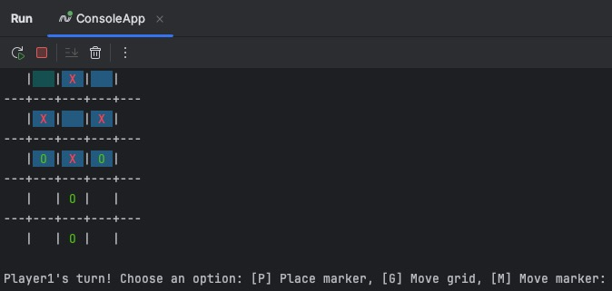
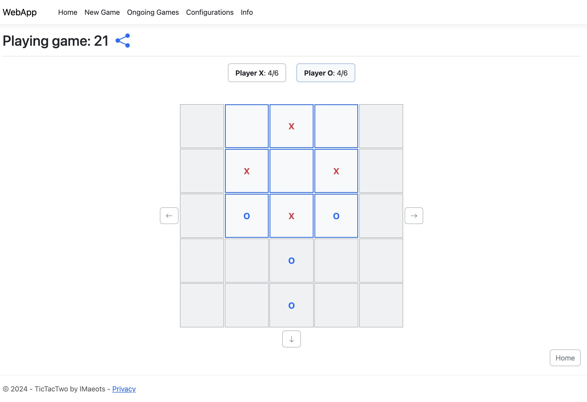

# TicTacTwo - Multi-Platform Collection

A collection of **Tic-Tac-Toe** game implementations across different platforms: **Console App**, **ASP.NET Core Web App**. This repo contains 2 versions of the TicTacTwo game, each with the same core gameplay, but built using different technologies.
This includes 2 out of 7 TicTacTwo games developed for Uni 2024-2025.

Each folder contains its own `README.md` to explain the specific implementation details of that version.

---

### 🚀 Game Overview

TicTacTwo is a creative twist on the classic **Tic-Tac-Toe** game. The game is played on a larger grid (by default 5×5), with a smaller section (by default 3×3) active at any time. As the game progresses, players can move their markers or even shift the active section of the grid. You can play **locally** with a friend, **online** with password protection, against the **AI**, or watch **bots vs bots** mode.

---

## Implementations

1. **TicTacTwo Console App** - C# Console Application
   - Location: `/TicTacTwo/ConsoleApp`
   - A **C# console application** implementation with colorful text-based UI and keyboard navigation.

2. **TicTacTwo Web App** - ASP.NET Core Razor Pages
   - Location: `/TicTacTwo/WebApp`
   - An **ASP.NET Core Razor Pages** implementation with responsive Bootstrap-based UI.

3. **Shared Components**
   - Location: `/TicTacTwo/Common`, `/TicTacTwo/Data`, `/TicTacTwo/GameLogic`
   - Common game logic, data models, and database interactions shared between implementations.

---

### 🎮 Game Description

TicTacTwo is an advanced version of **Tic-Tac-Toe** with unique game mechanics:

- The game is played on a **configurable board** (default 5×5), but only a smaller section (default 3×3) is active at any time
- After a configurable number of total moves, players can unlock special moves
- Special moves allow players to either place new markers, move existing ones, or shift the active playing area
- Each player has a maximum number of markers in total (configurable)
- Multiple game modes: **local two-player**, **single-player vs bot**, **online two-player**, and **bots vs bots**

---

### Common Features Across Implementations

- **Multiple Game Modes:**
  - Play locally with a friend
  - Play against the AI bot
  - Play online with password protection
  - Watch bots play against each other
  
- **Dynamic Gameplay:**
  - Place markers in the first phase
  - Move your markers or shift the active grid in the second phase
  
- **Game Configuration:**
  - Create and manage custom game configurations
  - Adjust board size, grid size, number of markers, and more
  
- **Game State Management:**
  - Save and resume games
  - Track game outcomes
  
- **Flexible Data Storage:**
  - SQLite database via Entity Framework Core
  - JSON file-based storage as an alternative

---

### 🚀 Getting Started

#### Prerequisites

- [.NET 9.0 SDK](https://dotnet.microsoft.com/download) or later
- Any modern web browser for the web application
- Terminal/Command Prompt for the console application

#### Installation

Clone this repository:

```bash
git clone https://github.com/IMaeots/TicTacTwoCSharp.git
cd TicTacTwoCSharp
```

See individual README files in each project folder for specific setup instructions.

## File Structure

- **Common**: Shared strings, utilities, entities.
- **ConsoleApp**: Contains all components necessary for the console application, including controllers and user interface elements.
- **Data**: Manages data access, manipulation, and persistence for the application.
- **GameLogic**: Holds UI game models and encapsulates their respective game logic & manipulation.
- **WebApp**: Contains all components necessary for the web application, including views & models.

## Screenshots




## 📝 License

All Rights Reserved

## Author

Name: Indrek Mäeots 
School email: inmaeo@taltech.ee

### Helpful dev commands:

Overall
~~~sh
dotnet tool install --global dotnet-ef 
dotnet tool update --global dotnet-ef

dotnet tool install --global dotnet-aspnet-codegenerator
dotnet tool update --global dotnet-aspnet-codegenerator
~~~

Run from solution folder
~~~sh
dotnet ef migrations add InitialCreate --project Data --startup-project ConsoleApp
dotnet ef database update --project Data --startup-project ConsoleApp
dotnet ef database drop --project Data --startup-project ConsoleApp 
~~~

Run from web folder (scaffolding)
~~~sh
dotnet aspnet-codegenerator razorpage -m SaveGame -outDir Pages/Games -dc GameDbContext -udl --referenceScriptLibraries -f
dotnet aspnet-codegenerator razorpage -m SaveGameConfiguration -outDir Pages/Configurations -dc GameDbContext -udl --referenceScriptLibraries -f
~~~
